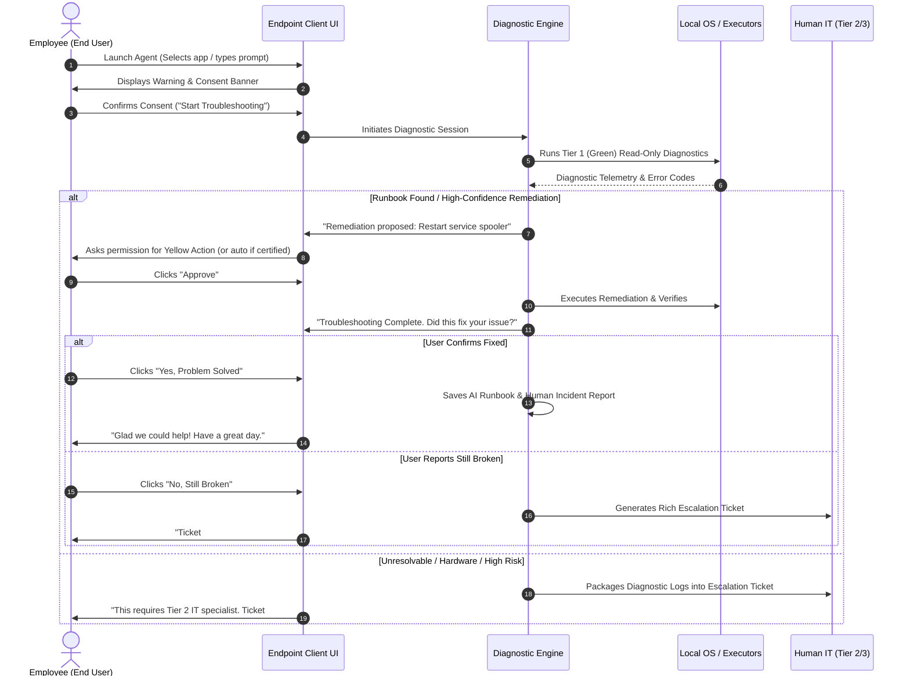

# End-User Journey & Escalation Protocol

## 1. End-User Workflow Overview



---

## 2. Step-by-Step Experience Design

### Step 1: Trigger & Intake
- The user launches the agent from their system tray or desktop shortcut.
- Two intake options:
  1. **Quick Select**: Dropdown of common problem areas (*"Network & VPN"*, *"Printer & Documents"*, *"Outlook/Teams"*, *"Legacy Apps"*).
  2. **Free Prompt**: Open text input (*"I cannot connect to the Paris branch VPN server"*).

### Step 2: Safety Warning & User Consent Banner
Before executing any action, the UI explicitly sets expectations:
> ⚠️ **AI IT Assistant Active**  
> *"The AI troubleshooter is preparing to inspect your local system settings and application logs. No personal files will be accessed. You can click 'Stop / Cancel' at any time."*  
> `[ Start Diagnostics ]` `[ Cancel ]`

### Step 3: Live Progress & Break-Glass Abort
- A live progress feed displays plain-English status updates (*"Checking network adapters..."*, *"Reading Windows event log..."*).
- An explicit **"Emergency Stop"** button is always accessible to terminate running agent processes immediately.

### Step 4: Resolution Verification
- The agent runs an automated verification check (e.g. pinging internal IP or checking service state).
- The agent directly asks the user:
  > ❓ **"We restarted the network adapter and flushed your DNS. Are you able to access the intranet now?"**  
  > `[ Yes, Problem Solved ]` `[ No, Still Broken ]`

---

## 3. The Escalation Hand-Off Protocol (When the Agent Cannot Solve It)

If the agent determines the issue is out-of-scope, or if the user clicks **"No, Still Broken"**, the agent generates a rich escalation payload for Tier 2/3 human support.

### Escalation Ticket Payload (Sent to ServiceNow / Jira)
```json
{
  "ticket_title": "Escalation: VPN connection failure on WS-FINANCE-019",
  "priority": "P3 - Moderate",
  "requester": {
    "username": "asmith",
    "email": "asmith@company.com",
    "department": "Finance"
  },
  "device_telemetry": {
    "hostname": "WS-FINANCE-019",
    "os_version": "Windows 11 Enterprise 23H2 (Build 22631.3007)",
    "uptime_hours": 72.4,
    "last_boot_reason": "Normal restart"
  },
  "issue_context": {
    "user_reported_symptom": "VPN fails with authentication error after password reset",
    "detected_error_codes": ["SEC_E_LOGON_DENIED (0x8009030C)", "EventID 4625"],
    "attempted_remediations": [
      {
        "action": "Clear cached Kerberos tickets via klist purge",
        "result": "Success",
        "verification_outcome": "Failed - Logon denied persists"
      },
      {
        "action": "Restart Cisco AnyConnect VPN Agent service",
        "result": "Success",
        "verification_outcome": "Failed - Server rejected credentials"
      }
    ],
    "agent_assessment": "Local endpoint network and services are operating normally. Issue is server-side Active Directory domain controller authentication rejection. Human Tier 2 account unlock or Kerberos re-sync required."
  }
}
```

### Why Human IT Teams Love This:
- Eliminates 100% of the useless initial questions (*"Did you reboot?"*, *"What version of Windows are you running?"*).
- Tier 2 technicians receive a complete audit trail of what was already attempted and can immediately take action on server-side or hardware fixes.
